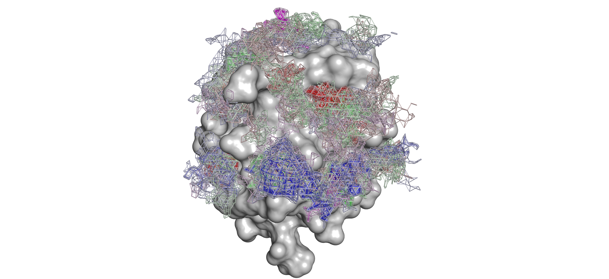

# Glycographer

## 3D receptor-glycoligand binding affinity landscape generation through fragment-based grid docking and volumetric characterization



The large size and structural complexity of most glycans and an emphasis on residue-dependent binding preference observed frequently in glycan-binding targets lends itself well to fragment-based molecular docking simulation; however, standard docking workflows are often unsuitable for accurately representing glycosidic torsions. Rosetta's GlycanDock protocol provides a significantly more robust approach to modeling and sampling receptor-glycoligand interactions, but is only intended for pose refinement and not de novo pose prediction. **Here, we provide a pipeline for mapping per-glycan fragment and per-glycan residue interactions in order to quantify the full binding-energy landscape between a queried receptor-glycan interaction.** Mapping per-fragment/residue glycan interaction energies over a putative target binding site shows detailed insight into possible glycan-binding orientation, the spatial dependence and relative magnitude of glycan residue binding preference between a range of queried glycans and a queried target, and design strategies tailored towards target binding optimization. Additionally, the volumetric data generated through GlycoMap is well suited for machine learning model training for spatial binding prediciton across a range of similar target structures.

## Dependencies

Glycographer requires the following software:

- Python 3.13+
- PyMOL 3+
- PyRosetta 4+
- Open3d

Only tested on Linux architecture so far.

## Installation and Environment Setup

```bash
# Clone this repository:
git clone https://github.com/jkantorow/glycographer.git
cd glycographer

# With standard pip:
python -m venv glycographer.venv
source glycographer.venv/bin/activate
python -m pip install --upgrade pip
pip install -r requirements.txt

# Or alternatively with conda:
conda env create -f environment.yaml
conda activate glycographer
```

## Quick Usage

Currently working on CLI integration and more streamlined usage.

```bash

# Generate glycan probes and docking grid:
python scripts/glycomodeler.py <glycan-iupac-string>
python scripts/build_gridbox.py <receptor.pdb>

# Concatenate receptor and ligand:
python scripts/utils/prepare_complexes.py -rec <receptor.pdb> -lig <ligand.pdb>

# Run probe sampling and generate energy voxel maps:
python scripts/run_glycandock.py <complex.pdb> -n <n-samples> -grid <grid>
python scripts/energy_map_combined.py -p <output_poses_regex_pattern>

# Output maps visualization as a PyMOL session file:
python scripts/vis/vis_glycomaps.py <map_files_regex_pattern> -rec <receptor.pdb>

```